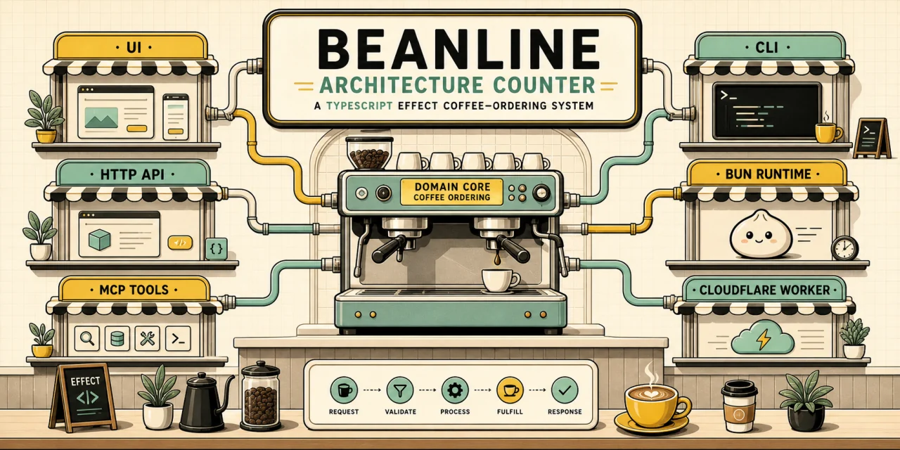
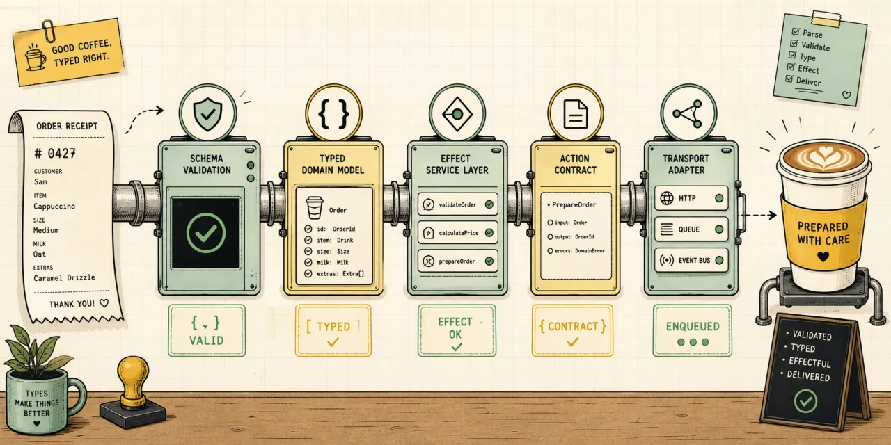
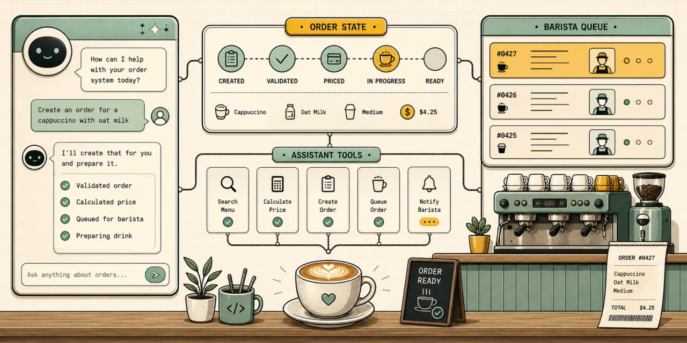
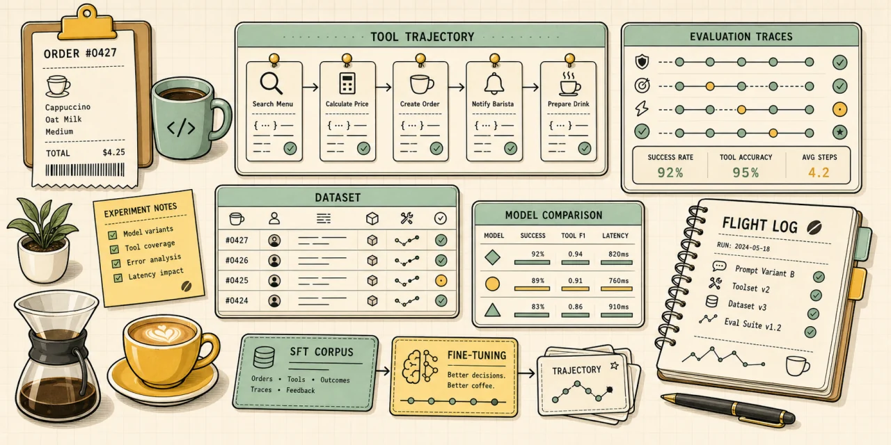

# effect-coffee-shop

Coffee-ordering app used to explore Onion Architecture with TypeScript, Bun,
and Effect.

The Coffee domain is shared across HTTP, CLI, MCP, assistant, auth, and browser
UI surfaces. Runtime shells compose that domain for local Bun execution,
Cloudflare Workers/D1 deployment, and an optional AWS/Postgres stack.

## What This Repo Demonstrates

- Effect-first domain and application code with explicit Layers, ports, and
  typed error channels.
- Onion Architecture boundaries between core business rules, presentation
  protocols, external adapters, and deployable runtime shells.
- One Coffee action catalog projected into MCP tools, assistant tools, and Agent
  Auth capabilities.
- A Vite/React browser app backed by the same HTTP API used by local and
  deployed runtimes.

## Quick Start

Use the Bun version from [`package.json`](./package.json):

```bash
bun install
```

Start the local backend API in one terminal:

```bash
bun run http
```

Start the browser app in another terminal:

```bash
bun run dev
```

The UI runs at `http://localhost:5173` and proxies `/api/*` to the Bun backend
at `http://localhost:3000`.

For Portless subdomains, passkey auth, assistant credentials, and proxy
overrides, see [`apps/ui`](./apps/ui).

## Architecture At A Glance

| Layer | Workspace | Owns |
| --- | --- | --- |
| Domain/application | [`packages/coffee/core`](./packages/coffee/core) | Coffee domain model, use cases, ports, actors, contracts, and repository contract tests. |
| Shared capabilities | [`packages/coffee/actions`](./packages/coffee/actions) | Neutral Coffee action names, schemas, dispatch, and result formatting. |
| Presentation | [`packages/coffee/presentation`](./packages/coffee/presentation) | HTTP, CLI, and MCP protocol adapters over the application service. |
| Assistant | [`packages/coffee/assistant`](./packages/coffee/assistant) | Provider-neutral assistant runtime, streaming chunks, model adapters, and tool projection. |
| Auth | [`packages/coffee/auth`](./packages/coffee/auth) | Better Auth setup, actor resolution, and Agent Auth capability execution. |
| External adapters | [`packages/coffee/external`](./packages/coffee/external) | In-memory, SQLite/D1, and Drizzle/Postgres implementations of Coffee ports. |
| Host utilities | [`packages/backend-host`](./packages/backend-host) | Runtime-agnostic Fetch host primitives, mounts, logging, and request-scoped services. |
| Runtime shell | [`apps/backend`](./apps/backend) | Bun, Cloudflare, and AWS composition roots that choose concrete Layers. |
| Browser app | [`apps/ui`](./apps/ui) | Vite/React UI, local proxying, passkey flows, and assistant client integration. |

## Choose Your Path

| Goal | Start Here |
| --- | --- |
| Run or change backend runtime composition | [`apps/backend/README.md`](./apps/backend/README.md) |
| Work on the browser UI | [`apps/ui/README.md`](./apps/ui/README.md) |
| Understand package boundaries | [`packages/README.md`](./packages/README.md) |
| Add or change Coffee business behavior | [`packages/coffee/core`](./packages/coffee/core) |
| Add a shared tool/capability action | [`packages/coffee/actions`](./packages/coffee/actions) |
| Change HTTP, CLI, or MCP surfaces | [`packages/coffee/presentation`](./packages/coffee/presentation) |
| Change assistant behavior or providers | [`packages/coffee/assistant`](./packages/coffee/assistant) |
| Change auth or Agent Auth capabilities | [`packages/coffee/auth`](./packages/coffee/auth) |
| Read the SFT experiment notes | [`docs/beanline-prime-intellect-flight-log.md`](./docs/beanline-prime-intellect-flight-log.md) |

## Common Commands

| Command | Purpose |
| --- | --- |
| `bun run http` | Run the local Bun HTTP API. |
| `bun run dev` | Run the Vite UI dev server. |
| `bun run cli -- menu list` | Smoke-check the Coffee CLI through the backend composition root. |
| `bun run mcp:stdio` | Run the MCP server over stdio. |
| `bun run mcp:http` | Run the MCP server over HTTP. |
| `bun run storybook` | Run the UI Storybook dev server. |
| `bun run build-storybook` | Build the UI Storybook static site. |
| `bun run check` | Run typecheck, lint, format check, tests, custom lint, and Fallow. |
| `bun run check:affected` | Run the affected workspace gate against the current branch. |
| `bun run build` | Build distributable workspace artifacts through Turborepo. |

Workspace-specific gates:

```bash
bun run --cwd apps/backend check
bun run --cwd apps/ui check
```

Hook checks:

```bash
bun run hooks:run:pre-commit
bun run hooks:run:pre-push
```

## Local Configuration

The root install covers all workspaces, uses the root dependency catalog, and
installs local Git hooks outside CI.

Environment examples live in:

- [`.env.example`](./.env.example): application, auth, assistant, observability,
  and deployment variables.
- [`.env.alchemy.example`](./.env.alchemy.example): Alchemy state and provider
  variables.

Local Beanline assistant setup is documented in [`apps/ui`](./apps/ui) and
[`packages/coffee/assistant`](./packages/coffee/assistant).

## Deployment

Infrastructure is managed with Alchemy.

```bash
bun run cf:configure
bun run cf:login
bun run infra:dev -- --profile default
bun run infra:deploy -- --profile default
```

[`alchemy.run.ts`](./alchemy.run.ts) is the deploy-target selector. It exports
the Cloudflare stack by default. Swap that single export to
`./infra/alchemy/aws.ts` for AWS.

The AWS stack expects `COFFEE_POSTGRES_URL` at deploy time and uses Alchemy's AWS
Lambda and Website resources for the runtime and static site. The `infra:*`
commands follow the selector; `cf:*` and `aws:*` stay pinned to their
provider-specific stack files.

## Project Images

| Beanline architecture counter | Typed order pipeline |
| --- | --- |
|  |  |

| Assistant at the bar | Flight log SFT workbench |
| --- | --- |
|  |  |

## Notes For Contributors

- Root tasks are run by Turborepo.
- `check:affected`, `build:affected`, and `test:affected` use Turborepo's
  affected mode against the current branch.
- `bun run tsgo:patch` opts into the Effect TypeScript language service binary;
  `bun run tsgo:unpatch` restores the stock native TypeScript binary.
- Decode external input at the boundary, preferably with `effect/Schema`, then
  pass typed domain values inward.
