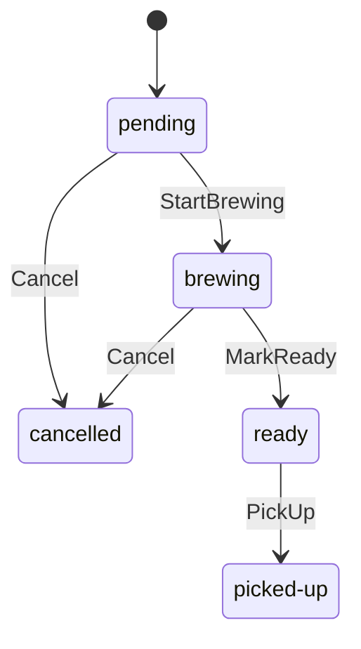

# Coffee Domain

`@effect-coffee-shop/coffee-domain` owns pure Coffee concepts: money, menu items,
orders, carts, checkout sessions, typed IDs, and domain errors. Import individual
modules such as `@effect-coffee-shop/coffee-domain/order`.

This package has no workspace dependencies. Application workflows, persistence,
transport contracts, and runtime wiring belong outside this boundary.

Run `typecheck`, `lint`, `lint:custom`, `fmt:check`, and `test` with
`bun run --cwd packages/coffee/domain <task>`.

## Order fulfillment

[`order-fulfillment.ts`](src/order-fulfillment.ts) defines the staff-controlled
order lifecycle with [`@typeonce/effect-machine`](https://github.com/typeonce-dev/effect-machine).
Its state paths are the existing `OrderStatus` values, and its typed event handlers
declare the five allowed edges. The library checks event names and destination
paths when the model compiles.

`picked-up` and `cancelled` have no handlers and are absorbing states. Repeated
commands, skipped steps, backward steps, and cancellation after readiness are
rejected. There is no command to return an order to `pending`.

The application authenticates staff, loads the order, calls
`transitionOrderStatus(from, to)`, and saves the status returned by `Machine.plan`.
The domain accepts a plan only when its settled status changes and equals the
requested target. Unhandled events and plans that settle elsewhere return
`Option.none`, which the application maps to the existing
`InvalidOrderStatusTransitionError` (HTTP 409) before any save. Machine planning
failures map to `InternalAppError`. All other order fields and the existing
authorization, persistence error mapping, and success observability are preserved.
`OrderStatus` and `orderStatuses` live in the lightweight `order` module; importing
order schemas or errors does not load the machine. Fulfillment helpers, including
`canTransitionTo`, are exported from `order-fulfillment`. That synchronous query
reads the machine's enabled events and is exact for this model because every
handler is unconditional.

Each command projects the repository's decoded status into a typed logical
snapshot. The model has no state data, invokes, timers, or commands, so planning
requires no live machine, fibers, or snapshot storage. The repository remains
authoritative and retains its existing read-then-save concurrency semantics.
Adding state-owned work or data would require revisiting this projection.

The dependency is pinned to `0.40.0`, the first release supporting stable Effect
4 (`effect: ^4.0.0`). The committed lockfile installs this adopted version alongside
the repository's Effect `4.0.0`; future dependency resolutions remain subject to
Bun's normal release-age quarantine.

Tests cover all 25 status pairs, multi-event fulfillment and cancellation traces,
and all five transition definitions with `MachineTest`. Application tests cover
all 20 staff-command/status combinations, persisted order preservation, rejection
without writes, authorization before repository access, missing orders, and read
and save failures.
